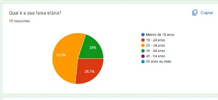
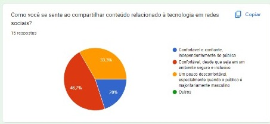
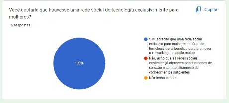
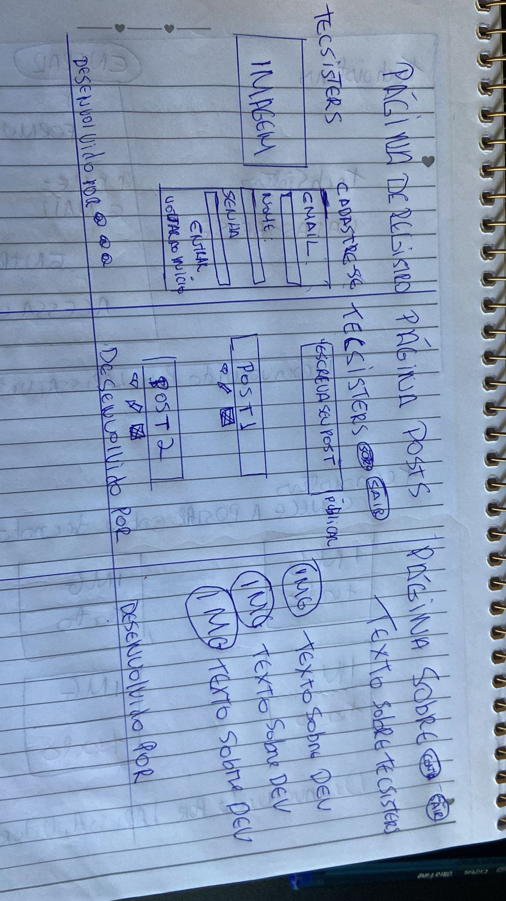
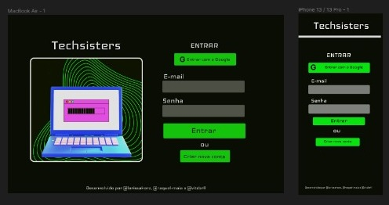
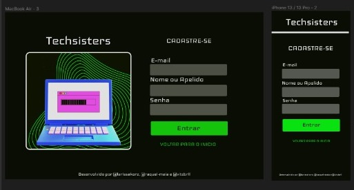
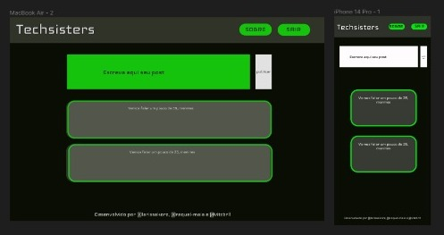

# Techsisters

## Índice

* [1. Resumo do projeto](#1-resumo-do-projeto)
* [2. Definição de produto](#2-definição-de-produto)
* [3. Pesquisas de usuário](#3-pesquisas-de-usuário)
* [4. História de usuário](#4-história-de-usuário)
* [5. Desenho da Interface de Usuário](#6-desenho-da-interface-de-usuário)
* [6. Considerações Técnicas](#4-considerações-tecnicas)
* [7. Ferramentas utilizadas](#4-ferramentas-utilizadas)
* [8. Sobre as desenvolvedoras](#4-sobre-desenvolvedoras)

***

## 1. Resumo do projeto

Techsisters é uma plataforma de rede social exclusiva para mulheres apaixonadas por tecnologia. Desenvolvida como parte do bootcamp da Laboratoria, nosso projeto Social Network oferece recursos como criação de conta, login, publicação e interação.

Utilizamos JavaScript e técnicas de múltiplas telas para criar uma experiência interativa. Aprendemos sobre autenticação com Firebase Auth, persistência de dados com Firestore e implementação de rotas.

Inspiradas por essa experiência, criamos a Techsisters como um ambiente seguro para mulheres se conectarem, compartilharem conhecimentos e apoiarem umas às outras. Nosso foco é aprimorar habilidades técnicas e proporcionar uma experiência agradável.
Junte-se à comunidade Techsisters, uma plataforma exclusiva para mulheres apaixonadas por tecnologia. Vamos aprender juntas e promover uma comunidade colaborativa e diversa.

Venha participar dessa jornada de conexão e crescimento!

## 2. Definição de produto

Techsisters é uma plataforma de rede social projetada para mulheres apaixonadas por tecnologia. Nosso objetivo principal é proporcionar um espaço seguro onde as mulheres possam compartilhar ideias, se expressar livremente e se conectar umas com as outras. Acreditamos que quando as mulheres se unem, elas têm o poder de desafiar limites, inspirar e transformar o mundo através da tecnologia.

De acordo com pesquisas realizadas durante o desenvolvimento do projeto, constatamos que 53% das mulheres com idade entre 25 e 34 anos gostariam que implementássemos duas funcionalidades: Recursos de incentivo ao empreendedorismo feminino e Mentoria e orientação profissional. Essa demanda pode ser interpretada como um indício de que as mulheres enfrentam desafios adicionais ou buscam apoio específico nesses aspectos da carreira profissional. Esses dados confirmam que as oportunidades na área de tecnologia ainda são majoritariamente voltadas para homens. Diante dessa constatação, uma das futuras funcionalidades da rede social será a possibilidade de os clientes oferecerem Recursos de incentivo ao empreendedorismo feminino por meio da Techsisters.

## 3. Pesquisas de usuário

Um dos objetivos do projeto era realizar entrevistas com os potenciais usuários. Para isso, utilizamos um formulário do Google Docs como ferramenta e criamos um questionário para compreender o perfil dos nossos possíveis usuários e analisar suas necessidades.

Durante a pesquisa, buscamos conhecer melhor o nosso público-alvo. Iniciamos o questionário com perguntas sobre idade e necessidades específicas. Dessa forma, identificamos que a maioria dos participantes era do sexo feminino e abrangia diversas faixas etárias, com necessidades semelhantes.

Nossa pesquisa revelou que 53% das mulheres estão na faixa etária de 25 a 34 anos, enquanto 20% estão nas faixas etárias de 18 a 24 e 35 a 44 anos.

Após identificar nossos usuários iniciais, também adicionamos uma pergunta para compreender como elas se sentem ao compartilhar conteúdo relacionado à tecnologia em redes sociais. Os resultados revelaram que:

33% se sentem um pouco desconfortáveis, especialmente quando o público é majoritariamente masculino.

Essas informações nos direcionam para criar uma plataforma segura, inclusiva e acolhedora, onde as mulheres podem compartilhar, se expressar e se conectar com outras apaixonadas por tecnologia. Nosso objetivo é proporcionar um refúgio virtual onde todas as usuárias se sintam empoderadas e apoiadas

Finalizamos a pesquisa com uma aceitação de 100% em relação à criação de uma rede social exclusiva para mulheres. Esses resultados confirmam a importância da pesquisa de usuários para orientar o desenvolvimento do projeto e nos fornecer uma visão mais clara para implementações futuras na rede social, considerando possíveis investimentos. Além disso, a pesquisa nos ajudou a compreender se as pessoas veem valor e benefícios em ter um espaço exclusivo para se conectar, compartilhar conhecimentos e experiências com outras mulheres na área de tecnologia.

## 4. História de usuário

### História de usuário 1:

> "Eu, na condição de visitante do site, estava navegando pela internet em busca de uma comunidade tecnológica exclusiva para mulheres. Foi quando me deparei com a Techsisters, uma rede social destinada a mulheres interessadas em compartilhar conteúdo relacionado à tecnologia. Com isso em mente, meu objetivo é ter a capacidade de me registrar, fazer login, publicar conteúdo, editar e excluir posts ao acessar o site. Além disso, também gostaria de obter informações sobre a empresa por trás da plataforma e conhecer a equipe responsável pelo desenvolvimento do site."

#### Critério de aceitação: 
- O usuário pode se registrar somente usando email, senha e preenchido o apelido/user de como gostaria de ser chamado
- Se o email no momento do preenchimento dos inputs estiver errado retorna um alert com “insira um email válido”
- O usuário pode se registrar de maneira rápida utilizando o “entrar com o google” onde um pop up é aberto e ele pode escolher em qual conta gostaria de fazer login.
- Só pode entrar na página de feed após for concluído o registro do usuário. 
- O registro deve ser realizado facilmente a partir de qualquer dispositivo preservando a interface do aplicativo. 

#### Definição de pronto:
- O código tem, e passa, os testes necessários.
- A página de login estava responsiva para todas as telas
- Finalizou-se a SPA (Single Page Application)
- A história implementada foi testada com, pelo menos 3 usuários 
- Realizou-se o deploy utilizando o git tag. 

### História de usuário 2:

> "Como usuário registrado, gostaria de ter a opção de fazer login de forma rápida e segura, utilizando a opção de login com o Google ou inserindo meu e-mail e senha nos campos fornecidos, para ter acesso aos diversos conteúdos disponíveis na plataforma Techsisters."

#### Critério de aceitação: 
- Com o usuário já registrado, seu e-mail e id estão salvos no banco de dados e ativo.
- No momento do preenchimento dos campos para logar no aplicativo, se e-mail e senha conferirem, o usuário clica no botão entrar e  tem acesso ao feed.
- Se o usuário preferir pode clicar no botão entrar com o google e após verificado se está cadastrado ele é redirecionado a página de feed onde poderá ver as postagens de outros usuários ou fazer as suas postagens. 
- Se por algum motivo o usuário errar no momento de preencher os dados no login aparecerá um alert com a seguinte mensagem “email ou senha inválidos”.

#### Definição de pronto:
- O código para o login tem autenticação Firebase;
- O código tem, e passa, os testes necessários.
- A página de login estava responsiva para todas as telas
- Finalizou-se a SPA (Single Page Application)
- A história implementada foi testada com, pelo menos 3 usuários

### História de usuário 3:

> "Como usuário registrado, ao entrar na página de posts da Techsisters, fiquei impressionado com as publicações inspiradoras das mulheres na comunidade. Decidi compartilhar minhas próprias experiências e interagir com outras usuárias, aprendendo com elas e contribuindo com meus conhecimentos. É importante para mim poder postar conteúdos relevantes e ter controle total sobre minhas publicações, incluindo a opção de excluir meus próprios posts, com uma confirmação prévia. Também gostaria de poder ver e dar likes nas publicações das outras mulheres na plataforma. Ter a exclusividade de excluir meus próprios posts é fundamental para manter a segurança e responsabilidade no ambiente da comunidade Techsisters."

#### Critério de aceitação:
- Página de feed
- Fazer uma publicação no feed
- Editar uma publicação no feed
- Excluir uma publicação no feed

#### Definição de pronto:
- O código guarda o post no Firebase;
- A página de posts estava responsiva para todas as tela
- A história implementada foi testada com, pelo menos 3 usuários 
- Construiu-se o teste das funções de like, editar e excluir post

### História do usuário 4

> "Eu como usuária de redes sociais, gostaria de poder sair da minha conta da Techsisters, com o objetivo de não deixar tantas contas de redes sociais abertas ao mesmo tempo."

#### Critérios de aceitação:
- Conseguir sair da conta
- Ter a opção de sair visível

#### Definição de pronto:
- Construiu-se o teste da função de deslogar da conta

## 5. Desenho da Interface de Usuário

#### Protótipo de baixa fidelidade

#### Protótipos de alta fidelidade

- PÁGINA INICIAL
  

- PÁGINA DE POSTS

## 6. Considerações Técnicas

O projeto foi desenvolvido somente em JavaScript (ES6), HTML e CSS. Ademais, não foi permitido o uso de bibliotecas e frameworks, apenas vanilla JavaScript, com exceção da biblioteca Firebase para gestão de usuário e base de dados.

## 7. Ferramentas utilizadas

- Figma;
- Trello;
- Vite,
- Firebase,
- Git;
- GitHub;
- Jest;
- Node.js;
- HTML5;
- CSS3;
- JavaScript;
- Visual Studio Code;

## 8. Sobre as Desenvolvedores

Vitoria Cabral: [Linkedin](https://www.linkedin.com/in/vitoria-cabral-oliveira/)
Raquel Maia: [Linkedin](https://www.linkedin.com/in/raquel-maia-860/)
Larissa Korz: [Linkedin](https://www.linkedin.com/in/larissakorz/)